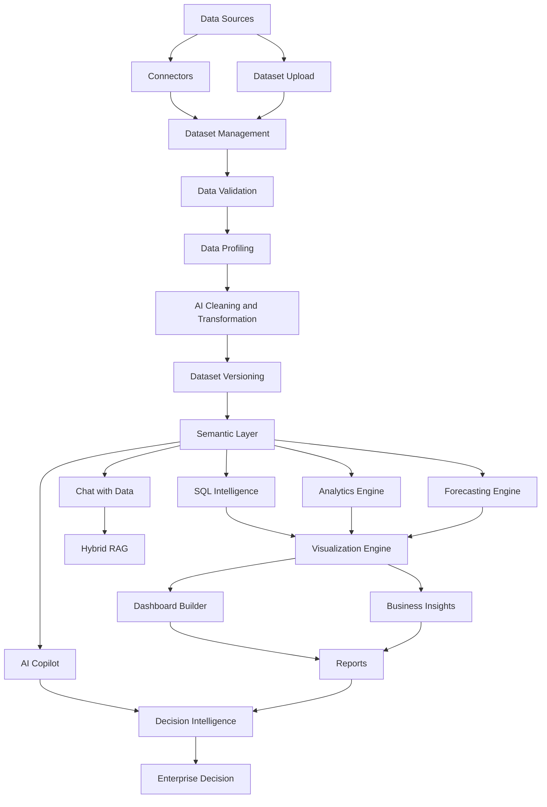

# NexusBI AI

### Enterprise AI-Powered Decision Intelligence Platform

NexusBI AI is an enterprise-grade Business Intelligence and Decision Intelligence platform that combines **AI, analytics, machine learning, SQL intelligence, forecasting, data visualization, workflow automation, and enterprise governance** into a unified platform.

It transforms raw business data into actionable insights through an end-to-end pipeline:

**Data → Intelligence → Analytics → Visualization → Decision**

---

## 🚀 Key Features

### 📊 Data Intelligence
- Dataset upload and management
- Immutable dataset versioning
- Automated data profiling
- Data quality scoring
- AI-powered data cleaning and transformation
- Semantic layer and business glossary
- Data lineage and impact analysis

### 🤖 AI & Machine Learning
- Natural Language → SQL
- Enterprise AI Gateway
- Multi-provider LLM support
- Multi-agent AI orchestration
- AI Copilot
- AI-powered business insights
- Forecasting and predictive analytics
- What-if parameter simulation
- AI memory and contextual sessions

### 📈 Analytics & Visualization
- Exploratory data analysis
- Statistical analysis
- Time-series forecasting
- Interactive visualizations
- Dashboard builder
- Executive dashboards
- Plotly and ECharts support
- Real-time streaming analytics

### 💬 AI Data Interaction
- Chat with enterprise data
- Hybrid RAG search
- Vector + BM25 retrieval
- Citation-aware responses
- Natural language analytics
- AI-generated SQL and insights

### ⚙️ Enterprise Automation
- Workflow automation
- Background job orchestration
- Scheduled pipelines
- Reports and notifications
- Real-time WebSocket updates
- Collaboration and team workflows

### 🔐 Enterprise Security & Governance
- JWT authentication
- RBAC
- OAuth2 / OIDC
- MFA / TOTP
- Personal Access Tokens
- Multi-tenant workspace isolation
- PII detection and masking
- Prompt injection protection
- SQL injection protection
- File upload security
- Audit logging
- Governance and compliance controls

### 🏢 Enterprise Platform
- Enterprise data catalog
- Global enterprise search
- Plugin SDK
- Connector framework
- Marketplace
- SaaS billing
- AI usage and cost tracking
- OpenTelemetry observability
- Prometheus metrics

---

## 🔄 Platform Workflow



---

## 🏗️ Architecture

```text
                         NexusBI AI
                             │
        ┌────────────────────┼────────────────────┐
        │                    │                    │
     Data Layer           AI Layer          Experience Layer
        │                    │                    │
   ┌────┴────┐        ┌──────┴──────┐       ┌────┴─────┐
   │ Datasets│        │ AI Gateway  │       │Dashboard │
   │Connectors│       │ AI Agents   │       │Analytics │
   │PostgreSQL│       │ RAG/Memory  │       │Reports   │
   │MongoDB  │        │ Copilot     │       │Chat      │
   │DuckDB   │        │ Forecasting │       │Visuals   │
   └─────────┘        └─────────────┘       └──────────┘
                             │
                    ┌────────┴────────┐
                    │ Enterprise Core │
                    │                 │
                    │ Security        │
                    │ RBAC            │
                    │ Governance      │
                    │ Audit           │
                    │ Lineage         │
                    │ Catalog         │
                    │ Search          │
                    │ Observability   │
                    └─────────────────┘
```

---

## 🧩 Core Platform Modules

| Module | Purpose |
|---|---|
| Dataset Management | Upload, validate and version datasets |
| Data Profiling | Statistics, quality scores and recommendations |
| AI Preprocessing | Intelligent cleaning and transformation |
| Semantic Layer | Business definitions and data understanding |
| SQL Intelligence | Natural language to safe SQL |
| Analytics | Statistical and exploratory analysis |
| Forecasting | Time-series prediction |
| Business Insights | AI-powered decision recommendations |
| Visualization | Interactive chart generation |
| Dashboard Builder | Custom business dashboards |
| AI Copilot | Multi-step AI assistance |
| Chat with Data | Natural language data exploration |
| RAG Engine | Hybrid semantic + keyword retrieval |
| Workflow Engine | Automated business pipelines |
| Job Engine | Background task execution |
| Data Catalog | Enterprise asset discovery |
| Governance | PII and compliance controls |
| Audit Center | System activity tracking |
| Marketplace | Plugins, connectors and templates |
| Observability | Metrics and system monitoring |

---

## 🛠️ Technology Stack

### Backend
- Python
- FastAPI
- SQLAlchemy
- PostgreSQL
- MongoDB
- Redis
- DuckDB
- Celery
- Alembic

### AI / ML
- LLM-based SQL generation
- Multi-agent orchestration
- RAG
- Embeddings
- Pandas
- NumPy
- Scikit-learn
- Statistical analysis
- Time-series forecasting

### Frontend
- React
- Next.js
- TypeScript
- Tailwind CSS
- Framer Motion
- Apache ECharts
- Plotly

### Infrastructure
- Docker
- Redis
- PostgreSQL
- OpenTelemetry
- Prometheus
- Git / GitHub

---

## 📁 Project Structure

```text
Nexus-BI/
│
├── Frontend/          # React / Next.js frontend
│
├── app/               # FastAPI backend
│   ├── api/
│   ├── analytics/
│   ├── agents/
│   ├── catalog/
│   ├── collaboration/
│   ├── copilot/
│   ├── dashboards/
│   ├── forecasting/
│   ├── governance/
│   ├── insights/
│   ├── jobs/
│   ├── lineage/
│   ├── marketplace/
│   ├── notifications/
│   ├── plugins/
│   ├── rag/
│   ├── reports/
│   ├── saas/
│   ├── search/
│   ├── security/
│   ├── streaming/
│   └── workflows/
│
├── migrations/        # Alembic migrations
├── tests/             # Unit and integration tests
├── docs/              # Documentation
│
├── docker-compose.yml
├── Dockerfile
├── alembic.ini
├── pyproject.toml
└── README.md
```

---

## 🔐 Enterprise AI Architecture

NexusBI AI uses an **Enterprise AI Gateway** to manage AI providers, routing, fallbacks, token usage, latency and cost tracking.

Supported providers include:

```text
                    AI Gateway
                        │
       ┌────────────────┼────────────────┐
       │                │                │
    OpenAI           Claude           Gemini
       │                │                │
     Azure           Ollama            Mock
       └────────────────┼────────────────┘
                        │
                AI Applications
                        │
       ┌────────────────┼────────────────┐
       │                │                │
    Copilot          RAG/Chat          Agents
       │                │                │
       └────────────────┼────────────────┘
                        │
                Decision Intelligence
```

---

## 🧪 Testing

The project includes unit and integration testing across the major platform modules.

Run:

```bash
pytest
```

Additional development checks:

```bash
ruff check app
mypy app
```

---

## 🚀 Running Locally

### Backend

```bash
pip install -r requirements.txt
alembic upgrade head
uvicorn app.main:app --reload
```

### Frontend

```bash
cd Frontend
npm install
npm run dev
```

### Docker

```bash
docker compose up --build
```

---

## 📊 Platform Capabilities

NexusBI AI provides an end-to-end workflow:

```text
Upload Data
     ↓
Validation
     ↓
Profiling
     ↓
AI Cleaning
     ↓
Transformation
     ↓
Semantic Understanding
     ↓
SQL / Analytics / Forecasting
     ↓
Visualization
     ↓
Dashboard
     ↓
AI Insights
     ↓
Reports & Decisions
```

---

## 👨‍💻 Author

### K. Yuvraj Sundaram

Computer Science (Data Science) Undergraduate  
Dayananda Sagar College of Engineering

Interested in:

**Artificial Intelligence • Machine Learning • Data Analytics • Business Intelligence • Generative AI • Full-Stack Development**

🔗 **LinkedIn:**  
https://linkedin.com/in/k-yuvraj-sundaram-a34790352

---

## ⭐ Project

**NexusBI AI — Enterprise AI-Powered Decision Intelligence Platform**

Built to transform enterprise data into **insights, predictions, visualizations, and actionable decisions**.

If you find the project interesting, consider giving the repository a ⭐.
